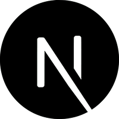
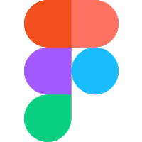

<h1>E aí 👋! Beleza?</h1> 

Bem-vindo ao meu perfil! Meu nome é <strong>Fernando Soares</strong> e trabalho atualmente como <strong>Desenvolvedor Web</strong>

<h4>Sobre mim</h4>

🎓 Cursando <b>Ciências da Computação</b> pela Universidade Paulista (UNIP), em Ribeirão Preto - SP

👨‍💻 Atuando como Desenvolvedor Web no Instituto Paulista de Gestão em Saúde (IPGS)

✏️ Unindo tecnologia e design para criar produtos que encantem e funcionem
&nbsp;

<h2 align="center">Conheça algumas das minhas skills</h2>
<h4 align="center">Front-end</h4>

  &nbsp;&nbsp;
  &nbsp;&nbsp;
  &nbsp;&nbsp;
  &nbsp;&nbsp;
  &nbsp;&nbsp;

    &nbsp;&nbsp;
    &nbsp;&nbsp;
    

<h4 align="center">Back-end</h4>
    

        &nbsp;&nbsp;
        
    

<h4 align="center">Banco de Dados</h4>
    

        &nbsp;&nbsp;
        
    

<h4 align="center">Ferramentas</h4>
    

        &nbsp;&nbsp;
        &nbsp;&nbsp;
        &nbsp;&nbsp;
        &nbsp;&nbsp;
        
    

